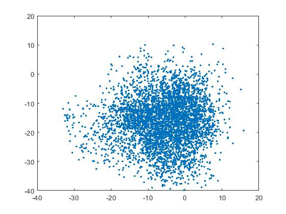
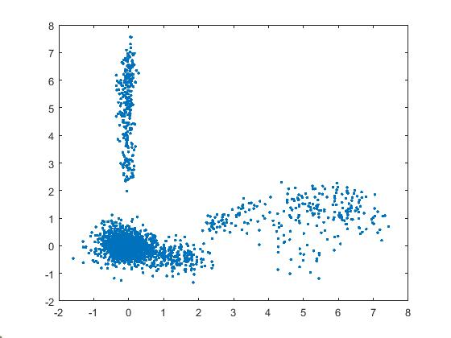
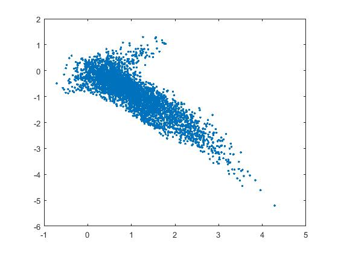

PAV - P4: reconocimiento y verificación del locutor
===================================================

Obtenga su copia del repositorio de la práctica accediendo a [Práctica 4](https://github.com/albino-pav/P4)
y pulsando sobre el botón `Fork` situado en la esquina superior derecha. A continuación, siga las
instrucciones de la [Práctica 2](https://github.com/albino-pav/P2) para crear una rama con el apellido de
los integrantes del grupo de prácticas, dar de alta al resto de integrantes como colaboradores del proyecto
y crear la copias locales del repositorio.

También debe descomprimir, en el directorio `PAV/P4`, el fichero [db_8mu.tgz](https://atenea.upc.edu/mod/resource/view.php?id=3654387?forcedownload=1)
con la base de datos oral que se utilizará en la parte experimental de la práctica.

Como entrega deberá realizar un *pull request* con el contenido de su copia del repositorio. Recuerde
que los ficheros entregados deberán estar en condiciones de ser ejecutados con sólo ejecutar:

~~~~~~~~~~~~~~~~~~~~~~~~~~~~~~~~~~~~~~~~~~~~~~~~~~~~~.sh
  make release
  run_spkid mfcc train test classerr verify verifyerr
~~~~~~~~~~~~~~~~~~~~~~~~~~~~~~~~~~~~~~~~~~~~~~~~~~~~~

Recuerde que, además de los trabajos indicados en esta parte básica, también deberá realizar un proyecto
de ampliación, del cual deberá subir una memoria explicativa a Atenea y los ficheros correspondientes al
repositorio de la práctica.

A modo de memoria de la parte básica, complete, en este mismo documento y usando el formato *markdown*, los
ejercicios indicados.

## Ejercicios.

### SPTK, Sox y los scripts de extracción de características.

- Analice el script `wav2lp.sh` y explique la misión de los distintos comandos involucrados en el *pipeline*
  principal (`sox`, `$X2X`, `$FRAME`, `$WINDOW` y `$LPC`). Explique el significado de cada una de las 
  opciones empleadas y de sus valores.

  Utilizamos el programa sox para leer los ficheros de entrada y extraer los datos en el formato que nos interesa, en este caso en crudo, formato de audio sin procesar.

  Con el comando X2X convertimos los datos de audio en formato binario sin procesar a un formato de punto flotante.

  Con el comando frame dividimos la trama en segmentos de 240 de longitud y desplazamiento de 80 muestras.

  Con el comando WINDOW aplicamos una ventana de análisis  a cada trama de audio. En este caso, la ventana tiene la misma longitud que la trama.

  Por último, con el comando LPC realizamos el análisis de predicción lineal en cada trama de audio. LPC order, indica el orden del modelo LPC.

- Explique el procedimiento seguido para obtener un fichero de formato *fmatrix* a partir de los ficheros de
  salida de SPTK (líneas 45 a 51 del script `wav2lp.sh`).

  Se calculan el número de filas y columnas del archivo y su contenido se guarda en una matriz.

  * ¿Por qué es más conveniente el formato *fmatrix* que el SPTK?

  El formato *fmatrix* no es un formato tan rígido de texto y puede permitir un orden más sencillo en cuanto a su lectura o compatibilidad. También permite ordenar datos de una forma lógica y eficiente.

- Escriba el *pipeline* principal usado para calcular los coeficientes cepstrales de predicción lineal
  (LPCC) en su fichero <code>scripts/wav2lpcc.sh</code>:

  sox $inputfile -t raw -e signed -b 16 - | $X2X +sf | $FRAME -l 240 -p 80 | $WINDOW -l 240 -L 240 |
	$LPC -l 240 -m $lpc_order | $LPC2C -m $lpc_order -M $cepstrum_order > $base.lpcc || exit 1

- Escriba el *pipeline* principal usado para calcular los coeficientes cepstrales en escala Mel (MFCC) en su
  fichero <code>scripts/wav2mfcc.sh</code>:

  sox $inputfile -t raw -e signed -b 16 - | $X2X +sf | $FRAME -l 240 -p 80 | $WINDOW -l 240 -L 240 |
	$MFCC -l 180 -m $mfcc_order -n $channel_order -w $window_type -a $prem_coef -s $sampling_rate -c $lift_coef > $base.mfcc || exit 1

### Extracción de características.

- Inserte una imagen mostrando la dependencia entre los coeficientes 2 y 3 de las tres parametrizaciones
  para todas las señales de un locutor.
  
  
  
  + Indique **todas** las órdenes necesarias para obtener las gráficas a partir de las señales 
    parametrizadas.

  run_spkid lpc
  run_spkid lpcc
  run_spkid mfcc

  fmatrix_show work/lp/BLOCK10/SES100/*.lp | egrep '^\[' | cut -f4,5 > lp.txt
  fmatrix_show work/lpcc/BLOCK10/SES100/*.lpcc | egrep '^\[' | cut -f4,5 > lpcc.txt
  fmatrix_show work/mfcc/BLOCK10/SES100/*.mfcc | egrep '^\[' | cut -f4,5 > mfcc.txt

  Ploteamos con Matlab:

  coef = importdata('mfcc.txt');
  plot(coef(:,1),coef(:,2), '.');

  + ¿Cuál de ellas le parece que contiene más información?

  La que tiene los puntos más dispersos parece ser mfcc, lo que nos indica incorrelación mayor.

- Usando el programa <code>pearson</code>, obtenga los coeficientes de correlación normalizada entre los
  parámetros 2 y 3 para un locutor, y rellene la tabla siguiente con los valores obtenidos.

  |                        | LP   | LPCC | MFCC |
  |------------------------|:----:|:----:|:----:|
  | &rho;x[2,3] |  -0.829169   |  0.101213     | 0.0403672       
  

  
  + Compare los resultados de <code>pearson</code> con los obtenidos gráficamente.

  Observamos que los resultados obtenidos concuerdan con las gáficas anteriores. Determianndo el mfcc como el más informativo.
  
- Según la teoría, ¿qué parámetros considera adecuados para el cálculo de los coeficientes LPCC y MFCC?

Para el LPCC se consideran entre 10 y 20 coeficientes, el uso de una ventana, típicamente Hamming, con duración de entre 20 y 30ms y desplazamiento de 10 a 15 ms.

Para el MFCC se consideran entre 24 y 40 filtros Mel, y el enventanado de entre 20 y 40 ms.
### Entrenamiento y visualización de los GMM.

Complete el código necesario para entrenar modelos GMM.

- Inserte una gráfica que muestre la función de densidad de probabilidad modelada por el GMM de un locutor
  para sus dos primeros coeficientes de MFCC.

- Inserte una gráfica que permita comparar los modelos y poblaciones de dos locutores distintos (la gŕafica
  de la página 20 del enunciado puede servirle de referencia del resultado deseado). Analice la capacidad
  del modelado GMM para diferenciar las señales de uno y otro.

### Reconocimiento del locutor.

Complete el código necesario para realizar reconociminto del locutor y optimice sus parámetros.

- Inserte una tabla con la tasa de error obtenida en el reconocimiento de los locutores de la base de datos
  SPEECON usando su mejor sistema de reconocimiento para los parámetros LP, LPCC y MFCC.

  |    Parametros          | LP    | LPCC  |  MFCC |
  |------------------------|:-----:|:-----:|:-----:|
  | FEAT order             |   10   |   30  |   20   |
  | Cepstrum order         |   -   |   29  |   -   |
  | Filter bank            |   -   |   -   |   35   |
  | Frequency              |   -   |   -   |   8   |
  | Nº of Mixtures         |   27   |   27  |   33   |
  | Max Iterations         |   20   |   20  |   20   |
  | Inicialization         |   VQ   |   VQ  |   EM   |
  | Tasa de error          |  9.43% | 0.38% |  1.02% |

### Verificación del locutor.

Complete el código necesario para realizar verificación del locutor y optimice sus parámetros.

- Inserte una tabla con el *score* obtenido con su mejor sistema de verificación del locutor en la tarea
  de verificación de SPEECON. La tabla debe incluir el umbral óptimo, el número de falsas alarmas y de
  pérdidas, y el score obtenido usando la parametrización que mejor resultado le hubiera dado en la tarea
  de reconocimiento.

  |    Parametros          | LP    | LPCC  |  MFCC |
  |------------------------|:-----:|:-----:|:-----:|
  |Tasa de error (Classify)|  8.15% | 0.38% |  1.02% |
  | Nº of Mixtures (World) |   27   |   27  |   27   |
  | Max Iterations (World) |   20  |   20  |   20   |
  | Inicialization (World) |   VQ  |   VQ  |   VQ   |
  | Misses                 |   64  |   14   |   18   |
  | False Alarms           |   22  |   2   |   5   |
  | Optimum Threshold      |0.557773760166403|0.596233041837599|0.578234374617886|
  | CostDetection          |   45.4   |   7.4   |   11.7   |
 
### Test final

- Adjunte, en el repositorio de la práctica, los ficheros `class_test.log` y `verif_test.log` 
  correspondientes a la evaluación *ciega* final.

### Trabajo de ampliación.

- Recuerde enviar a Atenea un fichero en formato zip o tgz con la memoria (en formato PDF) con el trabajo 
  realizado como ampliación, así como los ficheros `class_ampl.log` y/o `verif_ampl.log`, obtenidos como 
  resultado del mismo.
